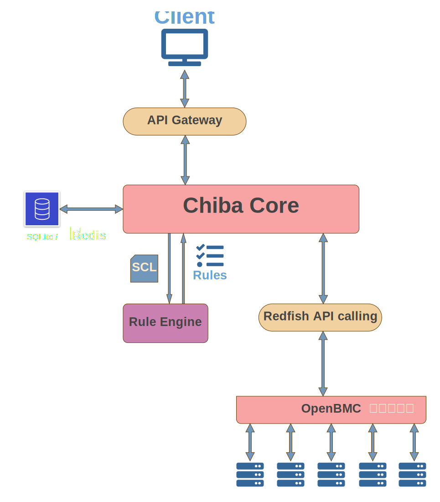

# Chiba project - the framework for next generation of cloud computing

## Intro

You might hear about fourth-generation data centers, or as they're more commonly known, [containerized data centers](https://www.techtarget.com/searchdatacenter/tip/An-overview-of-containerized-data-centers-and-their-benefits). The container mentioned here doesn't refer to a Docker container, but rather the actual shipping container you'd see at a port, typically carried on a truck trailer.

<center>

</center>

<center>

</center>

### How it works?

<center>

</center>

The containerized data center is a modular data center that is tailorable, portable and can be transported to any location. It's a self-contained unit that includes all the necessary components for a data center, such as servers, storage, networking equipment, and cooling systems. The containerized data center is typically housed in a shipping container, which makes it easy to transport and deploy.

Chiba project is a framework that leverages OpenBMC to provide infrastructure automation. It maintains backward compatibility with traditional cloud computing requirements like Kubernetes and virtualization. The Chiba project is designed to be a flexible and extensible framework that can be easily customized to meet the specific needs of different organizations.

Typically, Chiba runs on a management server that communicates with the OpenBMC firmware on the servers in the containerized data center. Chiba will interpreter the SCL (Server Configuration Language) scripts to manage the servers in the containerized data center. The SCL scripts can be used to define the configuration of the servers, monitor the servers, and take action based on the monitoring results. The SCL scripts will be executed by the Chiba server and finally transformed to Redfish API sent to the OpenBMC firmware of all servers in the containerized data center.

### Why name Chiba

Chiba is a Japan city with port, containers, and dockers. In [Neuromancer], it's also named **night city**. the underworld of the hackers that monitors and controls the upper world. So if you like the **night city** in 2077, now you know where it is.

The core concept of Chiba project is to take advantage of [OpenBMC](https://en.wikipedia.org/wiki/OpenBMC), the firmware that monitors and controls the upper world upon the motherboard, or you may say, the virtual reality dataspace that was named **the matrix** in Neuromancer.

## Why make Chiba?

Chiba project was created for fun and for profit.

### There're projects for controling OpenBMC, why bother to create another one?

Yes, there're projects for OpenBMC and Redfish API.

However, Chiba project is not for single node OpenBMC, it's for many or even massive OpenBMC nodes. It's for the next generation of cloud computing infrastructure.

### Who should use Chiba?

- **Cloud service providers**: Chiba can be used to build the next generation of cloud computing infrastructure.
- **Enterprises**: Chiba can be used to build the private cloud infrastructure.
- **Hardware vendors**: Chiba can be used to provide the firmware enhancement for the hardware products.
- **Security vendors**: Chiba can be used to provide the firmware security enhancement for the hardware products.

For now, we don't have real hardware (rack with OpenBMC) to test. If you are any of the above roles and interested in Chiba, please contact us: NalaGinrut@hardenedlinux.org.

**And if you are happen in Tokyo, let's have a coffee ;-).**

For technical geeks, Chiba is a good place to learn the OpenBMC and security enhancement for next generation of cloud computing.

## What's special?

### Infrastructure automation - the key point of the fourth-generation data centers

The traditional cloud computing is based on the virtualization, which is a software layer that abstracts the hardware resources. In the coming AI era, the hardware resources may include dedicated hardware accelerators, such as GPU, TPU, FPGA, etc. The virtualization is not enough to manage these resources. The auto scaling, auto healing, auto upgrading, etc, are the key features of the next generation of cloud computing. All these features are based on the core firmware of the hardware, which is the OpenBMC.

The Chiba project is a framework that leverages OpenBMC to provide infrastructure automation. It maintains backward compatibility with traditional cloud computing requirements like Kubernetes and virtualization.

### Security enhancement - prevent the Maginot Line

You may have good security software, such as firewall, IDS, IPS, etc. Linux kernel enhancement, such as SELinux, AppArmor. Or even advanced Linux kernel vaccine like [Grsecurity](https://grsecurity.net/), [VED from HardenedVault](https://hardenedvault.net/blog/2021-09-06-ved/), or [AKO from Hitachi](https://link.springer.com/content/pdf/10.1007/s10207-020-00514-7.pdf)...try to imagine, what if the attacker has the root privilege of the firmware like OpenBMC?

Then eveything is over. All your cybersecurity efforts become stupid [Maginot Line](https://en.wikipedia.org/wiki/Maginot_Line).

<center>

</center>

The only viable solution is to enhance security at the most fundamental level: the firmware. The Chiba project requires a securely enhanced OpenBMC firmware. While standard APIs are used, the actual OpenBMC firmware is typically customized by hardware vendors. This customization is necessary due to variations in resource definitions and control mechanisms across different vendors.

Consequently, in real-world product environments, Chiba must be tailored to align with the specific OpenBMC firmware in use, incorporating appropriate security enhancements. This customization requirement opens up opportunities for commercialization.

## Design

Chiba is developed in Guile Scheme, a dialect of Lisp. The Scheme language is chosen for its simplicity and elegance, which makes it easy to understand and maintain. The Scheme language is also a good choice for developing a domain-specific language (DSL) for infrastructure automation.

### SCL - Server Configuration Language

Please refer to the [SCL manual](docs/scl.md) for more details.

### Firmware Security Enhancement

Please refer to the [Firmware Security Enhancement manual](docs/firmware-security-enhancement.md) for more details.

### Architecture

<center>

</center>

## Installation

**NOTE: It is recommended to install the latest version of GNU Artanis, however, since the v0.6.1 hasen't been released yet, you can install the latest version from the source code.**

### Guix

GNU Guix is the advanced functional & transactional package manager, we recommend you to try it.
You may read the [GNU Guix installation](https://guix.gnu.org/manual/en/html_node/Installation.html)

```bash
guix install artanis
```

### Ubuntu
We only tested it on Ubuntu 24.04. Welcome to test it on other Linux distributions, and please let us know the result.

```bash
apt -qq -y install texinfo guile-3.0 guile-3.0-dev build-essential automake git autoconf libtool libmariadb-dev-compat libmariadb-dev libnss3 libnss3-dev

apt -qq -y install gettext redis redis-server libcurl4-openssl-dev
```

#### guile-dbi-2.1.8 (The tarball included guile-dbd) *[Optional]*
```bash
wget -c https://github.com/opencog/guile-dbi/archive/guile-dbi-2.1.8.tar.gz

tar xvzf guile-dbi-2.1.8.tar.gz
cd guile-dbi-guile-dbi-2.1.7/guile-dbi && ./autogen.sh --no-configure && ./configure && make
sudo make install
cd ../..
```

#### guile-dbd *[Optional]*. The dbd plugins connect to an actual database server.
```bash
cd guile-dbi-guile-dbi-2.1.8/guile-dbd-mysql && ./autogen.sh --no-configure && ./configure && make
sudo make install
```
MySQL is used for the examples in this manual. You may find dbd plugins for other databases
[[ https://github.com/opencog/guile-dbi][here]]. The installation process is identical.

#### guile-curl for the client module.
```bash
git clone https://github.com/spk121/guile-curl.git
cd guile-curl && git checkout v0.9
./bootstrap && ./configure --prefix=/usr && make -j
make install
ln -s /usr/lib/guile/3.0/extensions/libguile-curl.* /usr/lib/
ldconfig
```
**NOTE:** You may need to make necessary soft links according to above script.

#### guile-redis:
```bash
git clone https://github.com/aconchillo/guile-redis.git
cd guile-redis
git checkout -b 2.2.0
autoreconf -vif
./configure --prefix=/usr
make
make install
```

#### Install the latest GNU Artanis:*

```bash
git clone https://gitlab.com/hardenedlinux/artanis.git
cd artanis
./autogen.sh --no-configure
./configure
make -j
sudo make install
```

## Test

### For developers

It is recommended to test Chiba on a QEMU-based OpenBMC simulator. The following steps show how to set up the simulator:

#### Run OpenBMC simulator

```bash
- wget -c https://ozlabs.org/~joel/openbmc-qemu-tutorial/obmc-phosphor-image-romulus.static.mtd
- sudo apt install qemu-system-arm httpie
- bash scripts/run-openbmc-simulator.sh
```

#### Run Chiba

```bash
cd chiba
art work
```

### For vendors

In real-world product environments, Chiba must be tailored to align with the specific OpenBMC firmware in use, incorporating appropriate security enhancements. This customization requirement opens up opportunities for commercialization.

For now, we don't have real hardware to test. If you are a hardware vendor, please contact us: NalaGinrut@hardenedlinux.org.

Again, **if you are happen in Tokyo, let's have a coffee.**

## License and Authors

Chiba project is licensed under the GPLv3 license.

Chiba project is maintaining by [HardenedLinux community](https://hardenedlinux.org).
