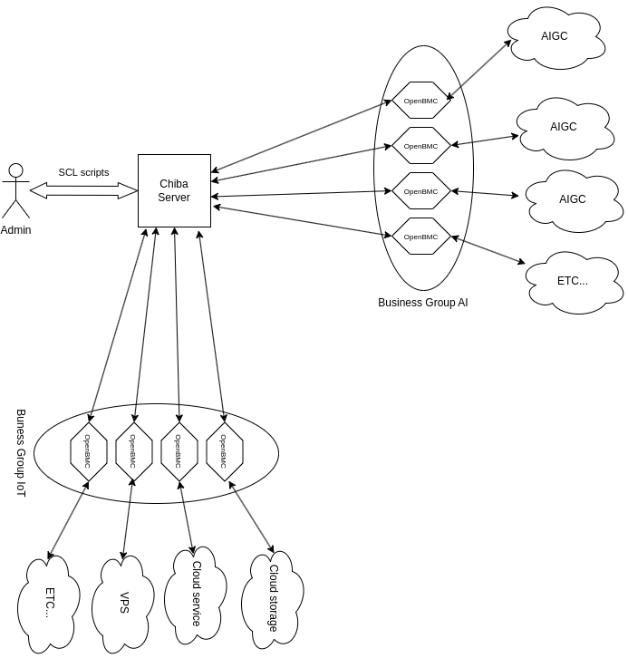

# Chibaプロジェクト - 次世代クラウドコンピューティングのフレームワーク

## 概要

次世代データセンター、または一般的に言う[コンテナ型データセンター](https://www.techtarget.com/searchdatacenter/tip/An-overview-of-containerized-data-centers-and-their-benefits)について聞いたことがあるかもしれません。ここで言う「コンテナ」とは、Dockerコンテナではなく、港で見るような実際の輸送用コンテナ、トレーラーに積載されるタイプのものを指します。

### 仕組みは？

コンテナ型データセンターは、モジュール型のデータセンターであり、カスタマイズ可能で、持ち運びが容易で、任意の場所に輸送可能です。サーバー、ストレージ、ネットワーク機器、冷却システムなど、データセンターに必要なすべてのコンポーネントを含む自己完結型のユニットです。コンテナ型データセンターは通常、輸送用コンテナに収容されており、輸送や展開が簡単です。

Chibaプロジェクトは、OpenBMCを活用してインフラストラクチャの自動化を提供するフレームワークです。Kubernetesや仮想化のような従来のクラウドコンピューティング要件と後方互換性を保ちながら設計されています。Chibaプロジェクトは、異なる組織の特定のニーズに合わせて簡単にカスタマイズできるように柔軟で拡張可能なフレームワークです。

通常、Chibaはコンテナ型データセンター内のサーバーのOpenBMCファームウェアと通信する管理サーバー上で実行されます。Chibaは、SCL（サーバー構成言語）スクリプトを解釈して、コンテナ型データセンター内のサーバーを管理します。SCLスクリプトは、サーバーの構成を定義し、監視し、監視結果に基づいてアクションを実行するために使用されます。SCLスクリプトはChibaサーバーによって実行され、最終的にRedfish APIに変換されて、コンテナ型データセンター内のすべてのサーバーのOpenBMCファームウェアに送信されます。

### なぜ「Chiba」という名前なのか

Chiba（千葉）は、港やコンテナ、ドッカーがある日本の都市です。[『ニューロマンサー』](https://en.wikipedia.org/wiki/Neuromancer)では、**ナイトシティ**とも呼ばれています。これは、上層世界を監視し制御するハッカーたちのアンダーワールドです。もし**Cyberpunk 2077**の**ナイトシティ**が好きなら、その場所がどこにあるか今わかりましたね。

Chibaプロジェクトの核心的な概念は、マザーボード上の上層世界を監視し制御するファームウェアである[OpenBMC](https://en.wikipedia.org/wiki/OpenBMC)を活用することです。あるいは、「ニューロマンサー」で「マトリックス」と呼ばれる仮想現実データ空間と言えるかもしれません。

## Chibaを作った理由

Chibaプロジェクトは、楽しみと利益のために作られました。

今日、私たちは非常に複雑なサプライチェーンに直面しています。その複雑さに対処するためにいくつかの最先端モデルがあります：
- **メインフレームのようなオールインワンソリューション**: x86サーバーの新しいサプライチェーンを構築するためのメインフレーム手法を使用します。例：[Oxide](https://oxide.computer/)。
- **GPU指向のコンピューティングノード**: ODMとしての役割を果たしながら、単一ノードのパフォーマンスを最大化し、コストパフォーマンスを最適化します。例：[Tinycorp - Tinybox](https://tinygrad.org/#tinybox)。
- **ビルディングブロックアプローチ**: OEMサプライチェーンの重要なコンポーネントをビルディングブロックに抽象化し、業界ユーザーのニーズに応じて自由に組み合わせます。例：[HardenedVault](https://hardenedvault.net/)。

### ブログ記事

英語

- [People who are really serious about AI should have their own datacenter](https://hardenedlinux.medium.com/people-who-are-really-serious-about-ai-should-have-their-own-datacenter-888cc10a0e4a)
- [Cloud Computing’s Hidden Hero: The Untold Story of OpenBMC](https://hardenedlinux.medium.com/cloud-computings-hidden-hero-the-untold-story-of-openbmc-1d15fd29f514)

### OpenBMCを制御するプロジェクトがすでにあるのに、なぜ新しいものを作るのか？

確かに、OpenBMCやRedfish APIを制御するプロジェクトはすでにあります。

しかし、Chibaプロジェクトは単一ノードのOpenBMCのためのものではなく、多くの、あるいは大量のOpenBMCノードのためのものです。これは次世代のクラウドコンピューティングインフラストラクチャのためのものです。

### Chibaの背後にいるのは誰？

Chibaプロジェクトは、[Open Source Firmware Conference](https://osfc.io)によって認められた[HardenedLinux](https://hardenedlinux.org)によって開発されています。OSFCは、サプライチェーンのオープンエコシステムのコミュニティを構築することを目指している組織です。

### Chibaを使用すべき人は？

- クラウドサービスプロバイダー: Chibaは次世代のクラウドコンピューティングインフラの構築に利用できます。
- 企業: Chibaはプライベートクラウドインフラの構築に利用できます。
- ハードウェアベンダー: OpenBMC標準にはハードウェアベンダー固有の部分が含まれており、Chibaでカスタマイズする必要があります。
- セキュリティベンダー: Chibaはハードウェア製品のファームウェアセキュリティ強化に利用できます。

現在、テストするための実際のハードウェア（OpenBMC搭載のラック）はありません。上記のいずれかの役割でChibaに興味がある場合は、NalaGinrut@hardenedlinux.orgまでご連絡ください。

**もし東京にいるなら、ぜひコーヒーでも飲みましょう ;-)。**

技術的なオタクにとって、Chibaは次世代クラウドコンピューティングのためのOpenBMCとセキュリティ強化を学ぶための良い場所です。

## 特徴

### インフラストラクチャの自動化 - 次世代データセンターの鍵

従来のクラウドコンピューティングは、ハードウェアリソースを抽象化するソフトウェアレイヤーである仮想化に基づいています。来るAI時代には、ハードウェアリソースにはGPU、TPU、FPGAなどの専用ハードウェアアクセラレータが含まれる可能性があります。仮想化ではこれらのリソースを管理するのは十分ではありません。自動スケーリング、自動修復、自動アップグレードなどは次世代クラウドコンピューティングの鍵となる機能です。これらすべての機能は、ハードウェアのコアファームウェアであるOpenBMCに基づいています。

Chibaプロジェクトは、OpenBMCを活用してインフラストラクチャの自動化を提供するフレームワークです。Kubernetesや仮想化のような従来のクラウドコンピューティング要件との互換性を維持しています。

### セキュリティ強化 - マジノ線を防ぐ

あなたには優れたセキュリティソフトウェア（ファイアウォール、IDS、IPSなど）や、Linuxカーネルの強化（SELinux、AppArmorなど）、または[Grsecurity](https://grsecurity.net/)のような高度なLinuxカーネルの保護策、[HardenedVaultのVED](https://hardenedvault.net/blog/2021-09-06-ved/)、[日立のAKO](https://link.springer.com/content/pdf/10.1007/s10207-020-00514-7.pdf)などがあるかもしれません。しかし、もし攻撃者がOpenBMCのようなファームウェアのroot権限を持っていたらどうでしょう？

すべてが終わりです。すべてのサイバーセキュリティの努力は愚かな[マジノ線](https://en.wikipedia.org/wiki/Maginot_Line)になります。

唯一の現実的な解決策は、最も基本的なレベルであるファームウェアでセキュリティを強化することです。Chibaプロジェクトは、セキュリティが強化されたOpenBMCファームウェアを要求します。標準のAPIが使用されていますが、実際のOpenBMCファームウェアは通常、ハードウェアベンダーによってカスタマイズされています。このカスタマイズは、異なるベンダー間でのリソース定義や制御メカニズムの違いのために必要です。

したがって、実際の製品環境では、Chibaは使用される特定のOpenBMCファームウェアに合わせて調整され、適切なセキュリティ強化を組み込む必要があります。このカスタマイズ要件は、商業化の機会を開きます。

## 設計

Chibaは、Lispの方言であるGuile Schemeで開発されています。Scheme言語は、そのシンプルさとエレガンスで理解と保守が容易です。また、インフラストラクチャの自動化用のドメイン固有言語（DSL）を開発するための良い選択でもあります。

### SCL - サーバー構成言語

詳細については、[SCLマニュアル](docs/scl.md)を参照してください。

### ファームウェアセキュリティの強化

詳細については、[ファームウェアセキュリティ強化マニュアル](docs/firmware-security-enhancement.md)を参照してください。

### アーキテクチャ

## インストール

[こちら](install_jp.md)

**再び、もし東京にいるなら、ぜひコーヒーでも飲みましょう。**

## ライセンスと著者

ChibaプロジェクトはGPLv3ライセンスの下でライセンスされています。

Chibaプロジェクトは[HardenedLinux community](https://hardenedlinux.org)コミュニティによって維持されています。
