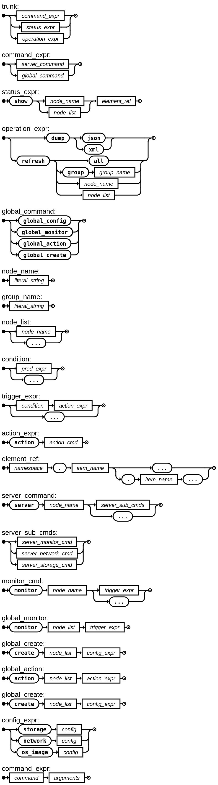

# SCL - Server Configuration Language (Draft)

**SCL is under development, and the syntax and features may change in the future.**

## Design Goals

SCL is a Domain-Specific Languages (DSL) for server configuration. It is designed to be simple and easy to understand. The SCL code is interpreted by the rule engine, which generates the configuration instructions for Redfish APIs to configure the server.


### What is S-Expression?

S-Expression is a simple and elegant way to represent the syntax tree of a language. It is widely used in Lisp and Scheme languages. The S-Expression is a list of lists, which is easy to parse and manipulate.

### Why S-Expression? It's not so popular and different from popular languages.

Good question!

Short answer: It reduces the complexity in Chiba core.

Longer answer: The S-Expression is simple and easy to parse, which is suitable for a DSL. The S-Expression is also easy to generate and manipulate, which is good for a rule engine.

To avoid language war and focus on the core features, the SCL is designed to be S-Expression based, which is suitable for a text based AST format. We just provide SCL as Intermediary Representation (IR) for the rule engine.

The language designer and compiler writers may design their own language, and compile it to SCL. Language hackers may design their own language, and compile it to SCL.

Originally, we prefer write SCL directly. The SCL is a simple language, and it's easy to learn.

## How it looks like?

The SCL is a simple language, and it's easy to learn. Here is an example of SCL code:

```scheme
(server "ai-node-0"
    (monitor "ai-node-0"
        (condition
            (or (> cpu.rate 80) (> cpu.temp 90)))
    (action (start-new-server-with-image "ai-node-1" "ubuntu-24.04-image"))))
```

It's in natural human language so that you can easily understand it.

Or more complex example:

```scheme
; Define a server with a name and basic configuration
(server "ServerName"
  (config
    (network
        (interface "eth0"
        (ip "192.168.1.100")
        (netmask "255.255.255.0")
        (gateway "192.168.1.1")))
    (storage
        (device "sda"
        (size "500GB")
        (type "SSD")))
    (power
        (state "on"))
    (bmc
        (user "root"
        (password "0penBMC")))))
```

## Syntax

The SCL sytanx was defined with [ISO-14977-EBNF](https://www.cl.cam.ac.uk/~mgk25/iso-14977.pdf), the text format can be found in [scl.ebnf](scl.ebnf).

Here's the Railroad Diagram of the SCL syntax:

<center>

</center>
